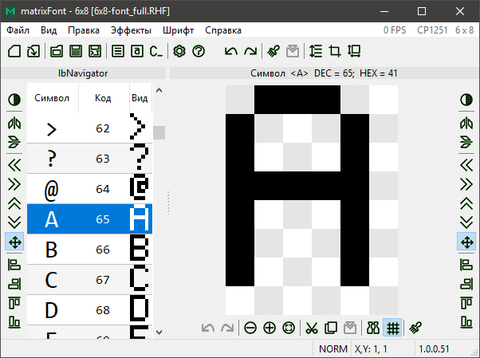
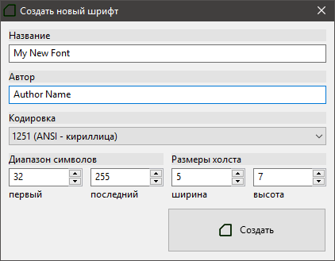
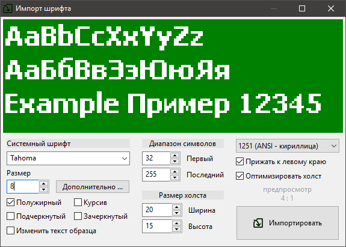
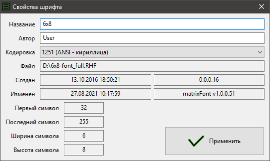
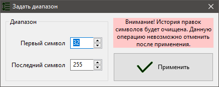
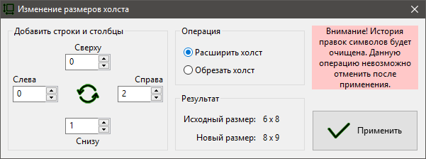
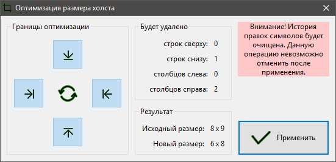
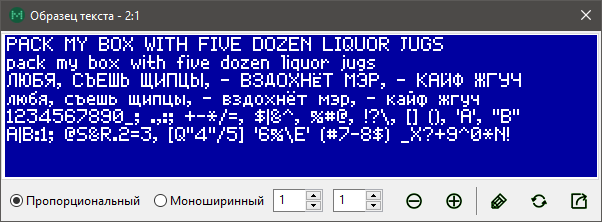
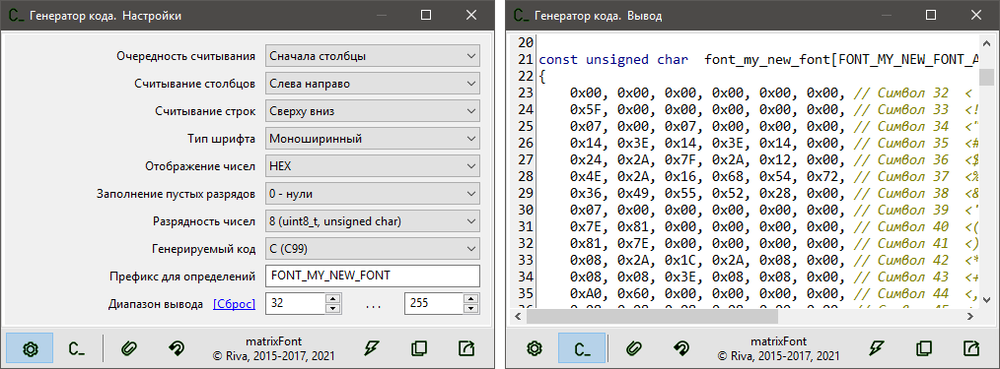
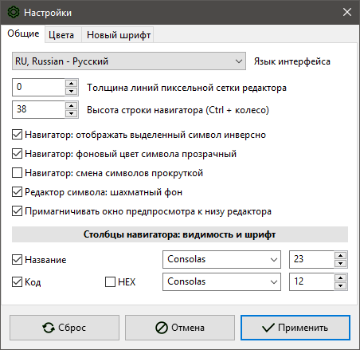

# matrixFont v1.0 // Руководство пользователя

[TOC]

# Введение

Приложение позволяет создавать, редактировать растровые шрифты и генерировать код **Си** для подключения созданного шрифта к проекту программного обеспечения. Основная область применения — разработка проектов программного обеспечения с использованием графического интерфейса пользователя во встраиваемых системах. 

Возможности приложения:

- диапазон символов шрифта от 0 до 255;
- размеры символа от 1х1 до 100х100;
- выбор кодовой страницы (кодировки);
- компактный собственный формат файла шрифта **RHF**;
- просмотр образца текста создаваемым шрифтом;
- создание проекта на основе системного шрифта (импорт с последующей растеризацией);
- гибко настраиваемая генерация кода **Си**;
- удобное редактирование символов мышью;
- история операций редактирования для каждого символа шрифта;
- копирование и вставка символов шрифта;
- поиск символов по коду или по названию;
- масштабирование рабочего поля редактора при помощи колеса мыши;
- пиксельная сетка, шахматный фон;
- эффекты редактирования: инверсия, отображение, сдвиг, прижатие символов;
- пакетное редактирование всех символов шрифта;
- навигатор по символам шрифта с отображением начертания созданных символов;
- оптимизация размера холста символов;
- изменение размера холста символов после создания проекта шрифта;
- изменение диапазона символов после создания проекта шрифта;
- широкие возможности настройки (внешний вид, цвета и прочее).

# Проект шрифта

## Создание шрифта

Команда `Файл > Новый шрифт` открывает диалог создания нового шрифта. Задайте название, автора, кодировку, код первого и последнего символа, ширину и высоту символа в пикселях. После нажатия кнопки `Создать` будет создан новый шрифт с заданными установками. Также новый шрифт с параметрами по умолчанию, которые можно изменить в настройках, создается автоматически при запуске приложения.

## Сохранение шрифта

Созданный и отредактированный шрифт можно сохранить в файл. Используется собственный компактный формат **RHF (Raster Hardware Font)**. Чтобы сохранить шрифт, выберите команду `Файл > Сохранить`. Если шрифт был загружен из файла, то команда `Файл > Сохранить` перезапишет исходный файл. Чтобы сохранить шрифт в другой файл используйте команду `Файл > Сохранить как…`

## Загрузка шрифта

Для загрузки ранее сохраненного шрифта в формате **RHF**, используйте команду `Файл > Открыть`. Также можно загрузить шрифт в приложение просто перетащив файл в окно приложения.

## Импорт системного шрифта

Приложение позволяет создать изображения символов шрифта, используя установленный в системе шрифт (TTF, OTF, FON и т.п.). Команда `Файл > Импорт шрифта` открывает диалоговое окно **Импорт шрифта**. 

Выберите шрифт, задайте его размер и начертание. Контролируйте вид символов по образцу текста, который выводится в верхней части окна. Образец можно масштабировать колесом мыши. Размеры холста символа устанавливаются автоматически, но их можно изменить. Задайте необходимую кодировку и дополнительные опции: прижатие символов к левому краю холста и оптимизация пустого пространства вокруг символа. Обратите внимание, что генерируемые изображения символов зависят от выбранной кодировки!

## Свойства шрифта

Команда `Файл > Свойства шрифта` отображает окно просмотра служебной и дополнительной информации о шрифте и файле. В окне **Свойства шрифта** отображаются следующие данные: название шрифта (используется при генерировании кода Си), автор шрифта, кодировка, расположение файла шрифта (если он был сохранен), коды первого и последнего символов, размеры холста символов (ширина и высота), дата и приложение создания шрифта, дата и приложение сохранения последней правки шрифта.

Название, автора и кодировку шрифта можно изменить, после чего нажать кнопку `Применить`, чтобы изменения были внесены. Остальные данные носят информационный характер и не подлежат редактированию в этом окне (для изменения диапазона или размеров холста есть специальные операции, описанные далее).

## Навигатор

Навигатор — левая часть главного окна. Представляет собой список символов шрифта. Позволяет быстро перемещаться между символами. Также отображает код символа (десятичный или шестнадцатеричный) и его начертание текущим редактируемым шрифтом. Высоту строки можно изменить колесом мыши с зажатой клавишей `Ctrl` или в настройках. Также в настройках можно изменить видимость отдельных столбцов и их шрифт.

# Редактирование символов

Редактор символов — правая часть главного окна. Контент в редакторе можно масштабировать колесом мыши или командами из меню `Вид > Масштаб`. Команда `Вид > Масштаб > Вписать` задает оптимальный масштаб так, чтобы холст целиком помещался в редакторе. Флаг `Вид > Сетка` управляет видимостью пиксельной сетки холста. Также в настройках можно включить шахматный фон в дополнение к сетке.

## Приемы

Поддерживается несколько приемов редактирования символов:

- [пиксельное](#Пиксельное редактирование);
- [операции с символом](#Операции редактирования символа);
- [пакетное редактирование](#Пакетное редактирование).

### Пиксельное редактирование

Это основной метод создания символов, осуществляется мышью в редакторе символа. Щелчок левой кнопкой устанавливает пиксель, правой — очищает, средней — инвертирует. Чтобы изменить всю строку, удерживайте `Ctrl` при щелчке кнопкой мыши. Чтобы изменить весь столбец, удерживайте `Shift` при щелчке кнопкой мыши.

### Операции редактирования символа

| Операция                   | Команда                                | Действие                                                     |
| -------------------------- | -------------------------------------- | ------------------------------------------------------------ |
| Очистка символа            | `Правка > Очистить`                    | стирает все установленные пиксели                            |
| Инверсия                   | `Эффекты > Инвертировать`              | инвертирует все пиксели символа                              |
| Горизонтальное отображение | `Эффекты > Отобразить > Горизонтально` | зеркально отображает символ в горизонтальной плоскости       |
| Вертикальное отображение   | `Эффекты > Отобразить > Вертикально`   | зеркально отображает символ в вертикальной плоскости         |
| Сдвиг                      | `Эффекты > Сдвиг > ...`                | перемещает символ на одну строку или столбец                 |
|                            | `Эффекты > Сдвиг > С переносом`        | если выбрана эта опция, то крайний вытесняющийся столбец или строка вставляется с противоположной стороны |
| Прижатие                   | `Эффекты > Прижать  > ...`             | перемещает символ к выбранному краю до тех пор, пока не останется чистого столбца или строки с этого края |

### Пакетное редактирование

Позволяет применить операцию ко всем символам шрифта. Операции аналогичны операциям с символом, находятся в меню `Шрифт`. Также есть несколько дополнительных операций для пакетной обработки.

**Обратите внимание!** После применения следующих операций история правок всех символов будет очищена. Эти операции невозможно отменить после применения.

#### Задание диапазона символов шрифта

Команда `Шрифт > Задать диапазон…` позволяет добавить в существующий шрифт новые символы или убрать ненужные (только с краев диапазона). В открывшемся диалоговом окне задайте коды начального и последнего символов шрифта. Если некоторые символы из предыдущего диапазона не войдут в новый диапазон, то они будут утеряны. Если новый диапазон содержит символы, которые не входили в предыдущий диапазон, то они будут созданы пустыми.

#### Изменение размеров символов шрифта

Команда `Шрифт > Изменить размер холста…` позволяет изменить размер холста символов существующего шрифта. В диалоговом окне выберите действие — расширить или обрезать, введите в соответствующие поля нужные значения.

#### Оптимизация размеров символов шрифта

Команда `Шрифт > Оптимизация размера холста…` удаляет общие для всех символов пустые строки и/или столбцы с краев холста. В диалогом окне задайте границы оптимизации — с каких краев нужно удалять пустые строки и/или столбцы.

## Отмена и повтор выполненной команды

Каждый символ имеет свою историю правок, куда записываются все этапы редактирования. История правок доступна только в текущем сеансе работы. История очищается у всех символов при создании нового шрифта, загрузке шрифта из файла или выполнении некоторых операций. Для перемещения по истории правок символа используйте команды `Отменить` и `Повторить` из меню `Правка`.

Для отмены или повтора пакетной операции предназначены команды `Отменить` и `Повторить` из меню `Шрифт`, которые применяют соответствующие символьные команды ко всем символам шрифта одновременно.

## Копирование и вставка символов

Меню `Правка` содержит команды для работы с буфером обмена: `Копировать`, `Вырезать`, `Вставить`. При копировании и вырезании в буфер обмена помещается весь символ целиком. При вставке символа из буфера обмена его верхний левый край совмещается с верхним левым краем текущего холста.

Поддерживается копирование/вставка символов между холстами разных размеров. Если вставляемый символ больше текущего холста, то будет вставлена только часть, которая помещается на текущем холсте. Если вставляемый символ меньше текущего холста, то он будет вставлен целиком, а оставшаяся часть текущего холста не будет изменена.

Также есть команда пакетной вставки `Шрифт > Пакетная вставка`, которая вставляет содержимое буфера обмена во все символы одновременно.

Меню `Правка > Режим вставки` позволяет выбрать один из 4 режимов вставки, см. таблицу.

| Режим вставки   | Описание                                                     |
| --------------- | ------------------------------------------------------------ |
| Замена (NORM)   | вставляемый символ заменяет текущий                          |
| И (AND)         | попиксельная операция И между вставляемым символом и текущим |
| ИЛИ (OR)        | попиксельная операция ИЛИ между вставляемым символом и текущим |
| Искл. ИЛИ (XOR) | попиксельная операция Искл. ИЛИ между вставляемым символом и текущим |

## Поиск

Команда-флаг `Правка > Найти…` позволяет быстро найти нужный символ в навигаторе и перейти к его редактированию. Если флаг установлен, в нижней части редактора отображается панель поиска, где можно задать поиск по символу или по его десятичному коду.

# Образец текста

Команда `Файл > Образец текста` показывает окно с образцом текста для визуальной оценки создаваемого шрифта. Образец можно масштабировать при колесом мыши, текущий масштаб отображается в заголовке окна.

Переключатель **Пропорциональный/Моноширинный** позволяет задать стиль формирования строк из символов. Если выбран стиль **Пропорциональный**, то все межсимвольные интервалы одинаковы и задаются значением поля **Дистанция между символами**. Если выбран стиль **Моноширинный**, то все символы располагаются в ячейках виртуальной сетки шириной равной ширине символа, дистанция между ячейками задается значением поля **Дистанция между символами**. Поле **Дистанция между строками** позволяет задать дистанцию между верхом текущей строки и низом предыдущей.

Текст образца может быть произвольным, состоящим из символов, которые входят в редактируемый шрифт. Текст можно изменить, нажав кнопку-флаг `Редактировать текст`.

Кнопка `Сохранить пример как изображение` позволяет сохранить текущее изображение текста образца в выбранном масштабе в формате **PNG**.

# Генерирование кода Си

После завершения редактирования шрифта можно сгенерировать соответствующий код на языке **Си** для использования шрифта в проектах программного обеспечения. Команда `Файл > Генерировать…` открывает окно генератора кода **Си**.

В окне генератора есть две вкладки: **Настройки вывода** и **Вывод**.

Во вкладке **Настройки вывода** можно гибко настроить параметры генерирования кода. Генерирование базируется на том, что каждый пиксель символа кодируется одним битом двоичного числа.

На вкладке **Вывод** расположено единственное поле, в котором содержится сгенерированный код. Код можно скопировать в буфер обмена (кнопка `Копировать в буфер`) или сохранить в заголовочный файл Си (кнопка `Экспорт в файл…`). Кнопка `Обновить вывод` обновляет код, если окно генератора открыто вместе с главным окном приложения, в котором продолжается редактирование шрифта. Кнопка-флаг `Поверх окна редактора` управляет видимостью окна генератора поверх окна главного окна приложения. Кнопка `Примагнитить справа от редактора` включает прилипание окна генератора к правому краю главного окна при изменении положения последнего на экране.

# Настройки

Для комфорта пользователя есть различные настройки внешнего вида и поведения приложения.

Команда-флаг `Вид > Поверх всех окон` управляет видимостью окна приложения — если флаг установлен, то приложение всегда будет отображаться поверх других окон, даже если оно теряет фокус.

Меню `Вид > Панели >` позволяет задать видимость панелей быстрого доступа.

Остальные настройки находятся в окне, которое можно вызвать командой `Файл > Настройки`.

# Помощь в интернационализации интерфейса

Автор будет благодарен за Вашу помощь в переводе интерфейса приложения и справочных материалов на Ваш родной язык.

Приложение разработано с возможностью легкой локализации интерфейса. Файлы локализаций размещаются в каталоге [bin/lang](../bin/lang).

Чтобы перевести интерфейс на другой язык, следуйте нижеприведенным инструкциям:

1. Скопируйте файл `*.ru.po` (каталог [bin/lang](../bin/lang)) и замените суффикс локали на свой, например, для немецкого `*.de.po`.
2. Откройте свой файл `*.??.po` в [Virtaal](http://translate.sourceforge.net/wiki/virtaal/index).
3. Осуществите перевод с русского на свой родной язык и сохраните переведенный файл.
4. Добавьте в `languages.ini` определение для своего перевода:
   - увеличьте значение `Count` на единицу (`Count` показывает число доступных локализаций),
   - добавьте строку вида `L-<index>=<locale><description>`, например,  `L-1=RU, Russian - Русский`,
   - обратите внимание, первые 2 символа описания должны совпадать с суффиксом локали (регистр не имеет значения).

